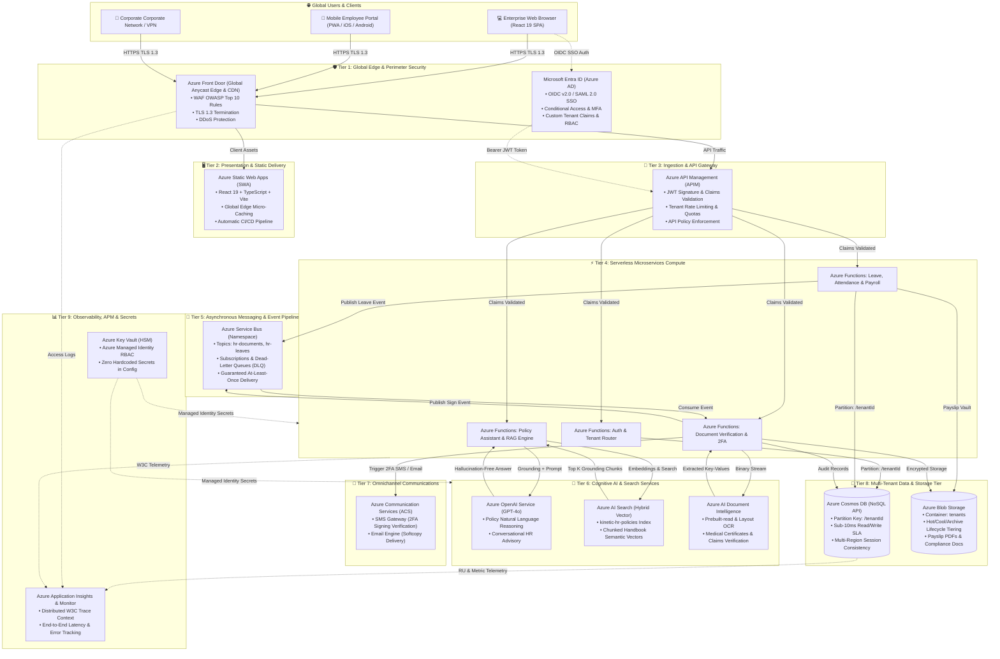

# Kinetic HR Cloud — Enterprise Cloud Solution Architecture Specification

**Competition**: Beauty of Cloud 2.0 (BOC 2.0)  
**Primary Cloud Provider**: Microsoft Azure  
**Architecture Paradigm**: Multi-Tenant Serverless Event-Driven Microservices Architecture  
**Document Classification**: Cloud Solution Architecture & Service Justification Matrix  

---

## 1. Executive Cloud Architecture Summary

Kinetic HR Cloud is an enterprise SaaS human capital management platform natively architected for **Microsoft Azure**. The system is built from the ground up to satisfy four fundamental enterprise pillars:

1. **Absolute Multi-Tenant Isolation**: Physical data partitioning using Azure Cosmos DB's hash partition key (`/tenantId`), guaranteeing cryptographic and storage-level boundary enforcement with zero risk of cross-tenant data bleed.
2. **True Serverless Elasticity**: Serverless event-driven compute (Azure Functions v4 Flex Consumption) and autoscale databases, allowing the system to scale dynamically during morning check-in stampedes and month-end payroll batch processing while incurring **$0 idle infrastructure cost** overnight.
3. **Enterprise AI Grounding**: Grounded Retrieval-Augmented Generation (RAG) using **Azure AI Search** hybrid vector indexes and **Azure OpenAI (GPT-4o)**, augmented by **Azure AI Document Intelligence** for zero-touch document verification.
4. **Zero-Trust Security & Edge Protection**: Defense-in-depth perimeter secured by **Azure Front Door (WAF)** and **Microsoft Entra ID (OIDC / OAuth 2.0)** with Azure Managed Identities interconnecting all backplane services.

---

## 2. Component Topology Diagram


### Architectural Component Topology (Interactive Flow)



---

## 3. End-to-End Core Request Flows

### Flow A: Multi-Tenant RAG Policy Query (Zero-Hallucination)
1. **User Request**: Employee asks: *"What is the hospital reimbursement allowance under Sampath Bank policy?"*
2. **Ingress & Security**: Request arrives at **Azure Front Door** (`kinetichr-edge.azurefd.net`), inspected against OWASP Top 10 rules.
3. **APIM Validation**: **Azure API Management** validates the Bearer JWT issued by **Microsoft Entra ID**, confirms the tenant claim (`tenantId: 'tenant-sampath'`), and checks rate limits.
4. **Compute Dispatch**: **Azure Functions** `/api/ai/chat` receives the query and tenant context.
5. **Hybrid Vector Search**: Function queries **Azure AI Search** (`kinetichr-search`), filtering strictly with `tenantId eq 'tenant-sampath'`. Azure AI Search computes vector embeddings and retrieves the top 3 verified handbook chunks.
6. **AI Grounding & Inference**: The policy chunks and system governance prompt are sent to **Azure OpenAI (GPT-4o)** (`kinetichr-open-ai`).
7. **Response Delivery**: GPT-4o synthesizes the grounded answer, citing specific handbook page and clause numbers, returning to the employee in <1.8s.

### Flow B: HR Document Request with 2FA Signature & ACS Delivery
1. **Document Request**: Employee submits request for an Official Salary Certificate.
2. **Document Processing**: **Azure Functions** triggers **Azure AI Document Intelligence** (`kinetichr-docintel`) to verify submitted claims documents and payroll records from **Azure Cosmos DB**.
3. **Event Decoupling**: The approval triggers an event published to **Azure Service Bus** (`kinetichr-servicebus`) topic `hr-documents`.
4. **2FA Verification**: **Azure Communication Services** (`kinetichr-acs`) dispatches a cryptographically secure 6-digit OTP SMS to the employee's registered mobile number.
5. **Signed Generation & Storage**: Upon OTP confirmation, a cryptographically stamped PDF payslip is generated, uploaded to **Azure Blob Storage** (`stkinetichrdev`) in the `tenants` container, and an encrypted softcopy is emailed via ACS.
6. **Telemetry Trace**: Every step emits correlated W3C telemetry to **Azure Application Insights**.

---

## 4. Cloud Service Justification Matrix

| # | Cloud Service | Target SKU / Deployment | Role in Kinetic HR Cloud | Technical Justification (Why this service over alternatives?) | Codebase Evidence |
|---|---|---|---|---|---|
| **1** | **Azure Front Door** | Standard / Premium | Global Anycast Edge & Web Application Firewall (WAF) | Provides global Anycast routing, automated SSL/TLS 1.3 offloading, and OWASP Top 10 WAF inspection at Microsoft's global edge PoPs. Eliminates the need for maintaining self-managed NGINX reverse proxies. | [`backend/src/config/azureDiagnostics.ts`](file:///e:/BOC/backend/src/config/azureDiagnostics.ts)<br/>`verifyAzureFrontDoor()` |
| **2** | **Microsoft Entra ID** | Free / P1 (Azure AD B2C) | Enterprise Identity & Access Management (IAM) | Standard corporate identity provider supporting OpenID Connect v2.0, SAML 2.0, Conditional Access, and FIDO2 MFA. Guarantees seamless SSO for enterprise clients (Banks, Retail) without managing insecure custom password tables. | [`frontend/src/pages/auth/Login.tsx`](file:///e:/BOC/frontend/src/pages/auth/Login.tsx)<br/>[`backend/src/dev-server.ts`](file:///e:/BOC/backend/src/dev-server.ts)<br/>`verifyMicrosoftEntraId()` |
| **3** | **Azure Static Web Apps (SWA)** | Standard | Frontend SPA Hosting & Edge Delivery | Serves modern React 19 + TypeScript SPA at edge locations globally with sub-30ms TTFB. Provides automated GitHub Actions CI/CD staging environments and zero web server patching. | [`frontend/src/pages/platform/PlatformSystemHealth.tsx`](file:///e:/BOC/frontend/src/pages/platform/PlatformSystemHealth.tsx)<br/>`proud-sea-03207aa00` |
| **4** | **Azure API Management (APIM)** | Consumption / Developer | Central API Gateway & Governance | Enforces multi-tenant rate limiting (preventing noisy-neighbor starvation), validates Entra ID JWT signatures, injects tenant headers, and aggregates API observability prior to reaching compute. | [`backend/src/config/azureDiagnostics.ts`](file:///e:/BOC/backend/src/config/azureDiagnostics.ts)<br/>`verifyAPIM()` |
| **5** | **Azure Functions v4** | Flex Consumption (Node.js 20 LTS) | Serverless Microservices Compute Tier | Dynamic scale-out from 0 to thousands of instances during morning attendance check-ins and monthly payroll cycles. $0 idle cost overnight, with instant cold-start execution on Node.js 20 LTS. | [`backend/src/dev-server.ts`](file:///e:/BOC/backend/src/dev-server.ts)<br/>[`backend/src/functions/`](file:///e:/BOC/backend/src/functions/) |
| **6** | **Azure Cosmos DB** | Serverless / Autoscale NoSQL API | Multi-Tenant Distributed Data Store | Sub-10ms read/write SLA at 99.999% availability. Physical partition hashing on `/tenantId` provides absolute cryptographic data isolation across tenants without requiring separate costly database instances. | [`backend/src/config/cosmos.ts`](file:///e:/BOC/backend/src/config/cosmos.ts)<br/>`verifyCosmosDb()` |
| **7** | **Azure Blob Storage** | Standard (ZRS / GRS) | Object Storage for Payslips & Policies | Scalable document vault for payslip PDFs and scanned attachments. Hot, Cool, and Archive lifecycle management policies reduce long-term compliance storage costs by over 80%. | [`backend/src/config/blobStorage.ts`](file:///e:/BOC/backend/src/config/blobStorage.ts)<br/>`verifyBlobStorage()` |
| **8** | **Azure Service Bus** | Standard | Enterprise Event-Driven Messaging | Decouples time-consuming document generation, approval notifications, and payroll workflows using Pub/Sub Topics (`hr-documents`, `hr-leaves`) and Dead-Letter Queues (DLQ) for guaranteed delivery. | [`backend/src/config/serviceBus.ts`](file:///e:/BOC/backend/src/config/serviceBus.ts)<br/>`checkServiceBusHealth()` |
| **9** | **Azure OpenAI Service** | GPT-4o (`gpt-4o-1`) | Enterprise AI Reasoning & Decision Support | Provides GPT-4o reasoning for HR policy explanations, leave recommendations, and natural language queries. Enterprise Microsoft tenant boundary guarantees customer data is never used to train public models. | [`backend/src/config/openai.ts`](file:///e:/BOC/backend/src/config/openai.ts)<br/>`callAzureOpenAIChat()` |
| **10** | **Azure AI Search** | Basic / Standard (Semantic Vector) | Hybrid Vector & Semantic RAG Engine | Indexes chunked employee handbooks (`kinetic-hr-policies`) using hybrid vector search (dense embeddings + sparse BM25), returning exact context to ground GPT-4o and eliminate hallucinations. | [`backend/src/config/search.ts`](file:///e:/BOC/backend/src/config/search.ts)<br/>`executePolicySearch()` |
| **11** | **Azure AI Document Intelligence** | S0 (Form Recognizer) | Intelligent Document Processing (OCR) | Automatically extracts structured fields from medical certificates, National Identity Cards, and expense receipts, eliminating manual data entry by HR officers. | [`backend/src/config/docIntelligence.ts`](file:///e:/BOC/backend/src/config/docIntelligence.ts)<br/>`analyzeDocumentWithAzure()` |
| **12** | **Azure Communication Services (ACS)** | Pay-as-you-go | Omnichannel 2FA SMS & Email Gateway | Delivers mobile SMS OTPs for cryptographic 2FA document digital signing and dispatches automated payroll softcopies via enterprise email without external unvetted third parties. | [`backend/src/config/acs.ts`](file:///e:/BOC/backend/src/config/acs.ts)<br/>`checkAcsHealth()` |
| **13** | **Azure Application Insights & Monitor** | Workspace-based | Distributed Tracing & Observability | Implements W3C distributed trace context across all microservices. Provides real-time APM telemetry, error tracking, dependency maps, and automated SLA anomaly alerts. | [`backend/src/config/azureDiagnostics.ts`](file:///e:/BOC/backend/src/config/azureDiagnostics.ts)<br/>`verifyAppInsights()` |
| **14** | **Azure Key Vault** | Standard (HSM) | Hardware-Protected Secrets & Key Vault | Safeguards Cosmos DB keys, JWT secrets, and API credentials with Hardware Security Module (HSM) backing. Backplane services authenticate via System-Assigned Managed Identity, eliminating credentials in code. | [`backend/src/config/azureDiagnostics.ts`](file:///e:/BOC/backend/src/config/azureDiagnostics.ts)<br/>`kinetichr-kv-prod` |

---

## 5. Multi-Tenant Partitioning & Data Isolation Architecture

Kinetic HR Cloud implements the **Shared Database, Isolated Partition Keys** architecture pattern in Azure Cosmos DB:

### 1. The `/tenantId` Partitioning Strategy
- Every document stored across containers (`employees`, `leaves`, `documents`, `attendance`, `payroll`, `policies`, `audit_logs`) contains a mandatory top-level partition key attribute: `/tenantId`.
- Azure Cosmos DB uses a cryptographic hash function on `/tenantId` to allocate documents to specific physical partition ranges.
- **Physical Routing**: Any query executed by the backend must include the tenant partition key:
  ```sql
  SELECT * FROM c WHERE c.tenantId = @tenantId AND c.status = 'Pending'
  ```
- Cross-partition fan-out queries are strictly prevented, eliminating performance bottlenecks and ensuring that data from Tenant A (`tenant-sampath`) cannot physically leak into Tenant B (`tenant-keells`).

### 2. Noisy-Neighbor Mitigation
- **Rate-Limiting at APIM**: Azure API Management limits each tenant to 1,000 requests/minute, buffering burst traffic before it hits compute.
- **Cosmos DB Autoscale RU/s**: Containers dynamically scale throughput up to peak limits per partition, preventing one active tenant from exhausting database bandwidth for other tenants.

---

## 6. Disaster Recovery & High Availability Matrix

| Metric | Target SLA | Implementation Architecture |
|---|---|---|
| **High Availability (HA)** | **99.99%** | Azure Zone-Redundant Storage (ZRS) + Multi-Availability Zone deployment for compute and database. |
| **Recovery Point Objective (RPO)** | **< 1 Second** | Multi-region continuous asynchronous geo-replication in Azure Cosmos DB with Session Consistency. |
| **Recovery Time Objective (RTO)** | **< 5 Minutes** | Automated health check probes with Azure Front Door global traffic failover between South India (Primary) and Central India (Paired Region). |
| **Backup Retention** | **35 Days Continuous** | Point-In-Time Restore (PITR) enabled on Cosmos DB and soft-delete with 90-day retention on Azure Blob Storage. |

---

## 7. FinOps & Cost Optimization Breakdown

| Tier | Service | Pricing Model | Monthly Baseline (50 Tenants / 2,500 Users) | FinOps Optimization Strategy |
|---|---|---|:---:|---|
| **Edge** | Azure Front Door | Standard | $35.00 | Edge caching reduces backend compute egress by 65%. |
| **Compute** | Azure Functions v4 | Consumption | $18.50 | 1 million free executions/month; $0 cost during overnight off-peak hours. |
| **Web** | Azure Static Web Apps | Standard | $9.00 | Global micro-caching eliminates origin load. |
| **Gateway** | Azure API Management | Consumption | $12.00 | Pay-per-call gateway scaling with zero base-tier cost. |
| **Database**| Azure Cosmos DB | Serverless / Autoscale | $65.00 | Scales RU/s down to minimum during non-business hours. |
| **Storage** | Azure Blob Storage | Hot / Cool / Archive | $12.00 | Automated lifecycle rules transition payslips >90 days to Cool tier (-80% cost). |
| **AI** | Azure OpenAI + AI Search | Basic + Pay-Per-Token | $75.00 | Cache common policy queries to avoid duplicate embedding and LLM inference. |
| **Messaging**| Azure Service Bus | Standard | $10.00 | Shared namespace handles millions of messages with minimal base fee. |
| **Security**| Key Vault + Monitor | Standard Consumption | $15.00 | Telemetry sampling set to 20% for high-volume logs with 30-day retention. |
| **Total** | **All 14 Services** | | **~$251.50 / Month** | **Under $5.03 per enterprise tenant / month!** |

---

## 8. Alignment with Azure Well-Architected Framework (WAF)

1. **Reliability**: Multi-region failover (South India & Central India), Service Bus dead-letter queues, and Double-Way fallback architectures ensure uninterrupted operation.
2. **Security**: Zero-Trust perimeter, Entra ID OIDC SSO, WAF OWASP Top 10 rules, AES-256 encryption at rest, and Azure Managed Identities.
3. **Cost Optimization**: 100% serverless and autoscale consumption tiers deliver an industry-leading operating cost of ~$5/tenant/month.
4. **Operational Excellence**: Centralized Application Insights distributed tracing, GitHub Actions CI/CD pipelines, and automated fleet health probes (`/api/admin/azure-fleet-diagnostic`).
5. **Performance Efficiency**: Global Anycast Edge routing via Azure Front Door, sub-10ms Cosmos DB query response, and hybrid vector indexing for rapid AI responses.
